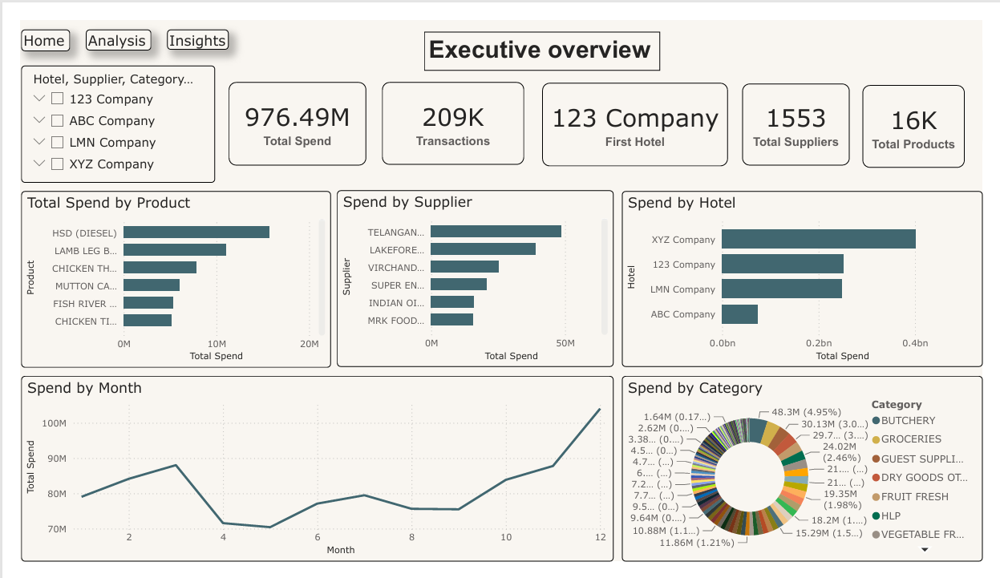
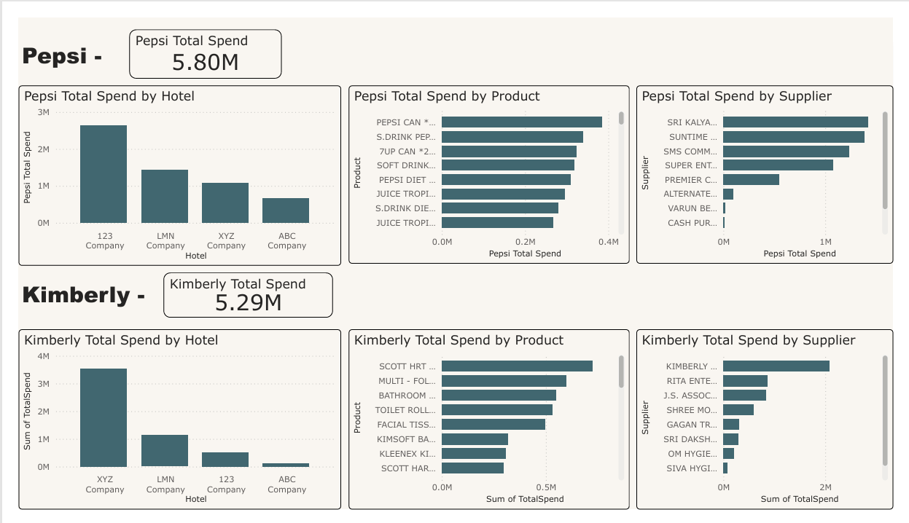
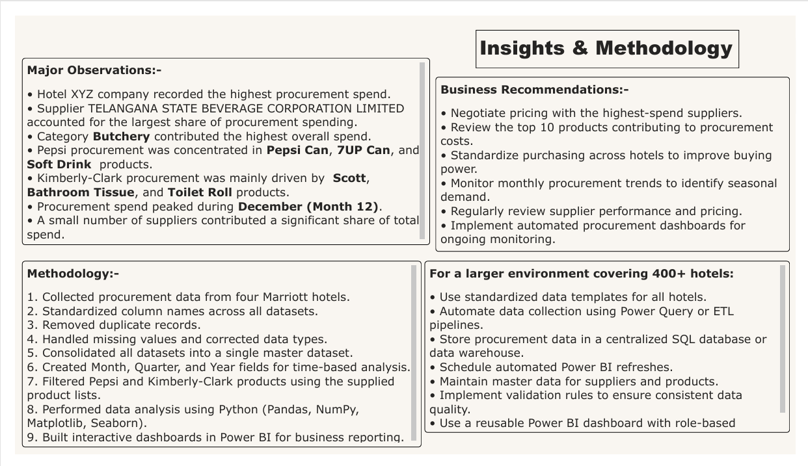

# 🏨 Hotel Procurement Spend Analysis using Python & Power BI

> **End-to-End Procurement Analytics Project** transforming **209K+ procurement transactions** into actionable business insights using **Python, Excel, and Power BI**.

---

# 📊 Project Highlights

| Metric | Value |
|---------|------:|
| 💰 Total Procurement Spend | **976.49M** |
| 📄 Procurement Transactions | **209K+** |
| 🏨 Hotel Properties | **4** |
| 🏢 Suppliers Analyzed | **1,553** |
| 📦 Products Analyzed | **16K+** |
| 📈 Dashboard Pages | **3** |
| 📊 Analysis Techniques | **EDA, ABC Analysis, Pareto Analysis** |
| 🛠 Tools Used | **Python, Excel, Power BI** |

---

# 📌 Project Overview

Procurement teams generate massive volumes of purchasing data across multiple hotel properties. This project consolidates and analyzes procurement transactions to uncover supplier performance, spending patterns, inventory priorities, and procurement optimization opportunities.

The project demonstrates the complete analytics lifecycle—from **data cleaning and transformation** to **interactive dashboard development** and **business recommendations**.

---

# 🎯 Business Objectives

- Consolidate procurement data from multiple hotel properties
- Standardize inconsistent procurement records
- Analyze procurement spending across suppliers and categories
- Identify high-value inventory using **ABC Classification**
- Evaluate supplier dependency using **Pareto Analysis**
- Monitor monthly procurement trends
- Build executive dashboards for decision-makers

---

# 🛠 Tech Stack

| Tool | Purpose |
|------|---------|
| 🐍 Python | Data Cleaning & Analysis |
| 🐼 Pandas | Data Transformation |
| 🔢 NumPy | Numerical Computing |
| 📊 Matplotlib | Data Visualization |
| 📑 Microsoft Excel | Data Validation |
| 📈 Power BI | Interactive Dashboard |
| 📓 Jupyter Notebook | Data Analysis |

---

# 🔄 Project Workflow

```text
Raw Excel Procurement Files
            │
            ▼
 Data Cleaning (Python)
            │
            ▼
 Data Transformation
            │
            ▼
 Exploratory Data Analysis
            │
            ▼
     ABC Analysis
            │
            ▼
   Pareto Analysis
            │
            ▼
 Interactive Power BI Dashboard
            │
            ▼
 Business Insights & Recommendations
```

---

# 📈 Dashboard Features

## 📊 Executive Dashboard

- Total Procurement Spend
- Total Transactions
- Total Suppliers
- Total Products
- Spend by Hotel
- Spend by Supplier
- Spend by Category
- Monthly Procurement Trend
- Top Procurement Products

---

## 🥤 Brand Procurement Analysis

### Pepsi

- Spend by Product
- Spend by Supplier
- Spend by Hotel

### Kimberly-Clark

- Spend by Product
- Spend by Supplier
- Spend by Hotel

---

## 💡 Insights Dashboard

- Major Procurement Observations
- Procurement Methodology
- Business Recommendations
- Enterprise Scalability Suggestions

---

# 📉 Analytical Techniques

### 📊 Exploratory Data Analysis (EDA)

- Hotel-wise Procurement Spend
- Supplier Performance
- Category Analysis
- Monthly Procurement Trends
- Product-Level Analysis

---

### 📦 ABC Inventory Analysis

Applied the **ABC Classification (80/20 Principle)** to categorize products based on procurement value.

✔ Identified high-value products requiring tighter inventory control

✔ Prioritized inventory management for maximum business impact

---

### 📈 Pareto Analysis

Applied the **Pareto Principle (80/20 Rule)** to identify supplier concentration.

✔ Identified suppliers contributing to the majority of procurement spending

✔ Highlighted supplier negotiation opportunities

✔ Supported supplier risk assessment

---

# 🚀 Key Insights

- 💰 Analyzed procurement spend worth **976.49M**
- 📄 Processed **209K+ procurement transactions**
- 🏢 Evaluated procurement across **1,553 suppliers**
- 📦 Analyzed **16K+ products**
- 🏨 Consolidated procurement data from **4 hotel properties**
- 📈 Procurement spend peaked during **December**
- 🥩 **Butchery** emerged as the highest spending category
- 🥤 Pepsi procurement was primarily driven by canned beverages
- 🧻 Kimberly-Clark procurement was dominated by tissue and hygiene products
- 📊 Supplier concentration revealed opportunities for strategic contract negotiations

---

# 💼 Business Impact

This analysis helps procurement teams to:

- Reduce procurement costs
- Improve supplier negotiations
- Prioritize high-value inventory
- Identify supplier dependency risks
- Monitor procurement KPIs
- Improve purchasing efficiency
- Support data-driven decision-making

---

# 📷 Dashboard Preview

## 🏠 Executive Dashboard

<p align="center">

</p>

---

## 🥤 Pepsi & Kimberly-Clark Analysis

<p align="center">

</p>

---

## 💡 Insights & Recommendations

<p align="center">

</p>

---

# 📂 Repository Structure

```text
Hotel-Procurement-Spend-Analysis
│
├── data/
├── cleaned_data/
├── notebooks/
├── dashboard/
├── reports/
├── images/
│   ├── executive_dashboard.png
│   ├── brand_analysis.png
│   └── insights_dashboard.png
├── README.md
├── requirements.txt
└── LICENSE
```

---

# 🛠 Skills Demonstrated

- Data Cleaning
- Data Transformation
- Exploratory Data Analysis (EDA)
- Business Intelligence
- Procurement Spend Analysis
- Supplier Performance Analysis
- Inventory Analytics
- Product Category Analysis
- Time Series Analysis
- ABC Inventory Classification
- Pareto Analysis
- Dashboard Development
- Data Visualization
- Business Storytelling
- Python
- Power BI
- Excel

---

# 📬 Contact

**Chennakeshav Kanepogu**

💼 Data Analyst | Business Intelligence | Power BI | Python | SQL

🔗 **LinkedIn:** https://www.linkedin.com/in/chennakeshav-kanepogu

💻 **GitHub:** https://github.com/Chennakeshav2003

---

⭐ **If you found this project useful, consider giving it a Star!**
